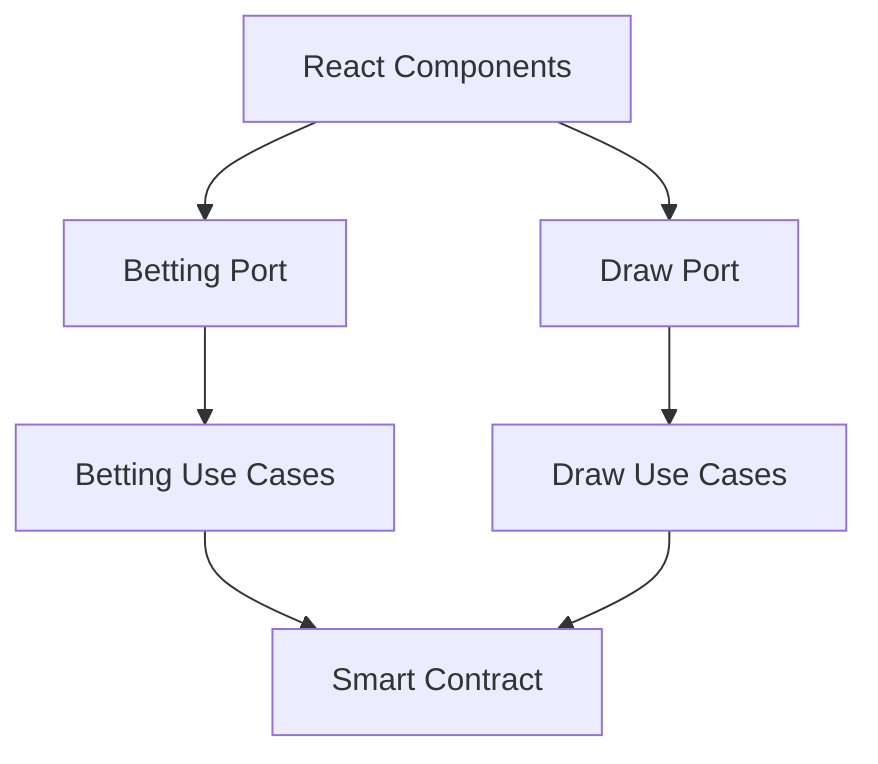

# TWA Open Lottery: A Deep Dive into Hexagonal Architecture

## Introdução

O TWA Open Lottery é uma plataforma moderna de loteria construída sobre a blockchain TON, implementando uma arquitetura hexagonal (também conhecida como ports and adapters) para garantir um sistema modular, testável e altamente adaptável. Este artigo explora em detalhes como a arquitetura foi implementada e seus benefícios.

## Sumário
1. [Visão Geral da Arquitetura](#visão-geral-da-arquitetura)
2. [Camadas da Aplicação](#camadas-da-aplicação)
3. [Implementação Detalhada](#implementação-detalhada)
4. [Benefícios e Trade-offs](#benefícios-e-trade-offs)
5. [Exemplos Práticos](#exemplos-práticos)

## Visão Geral da Arquitetura

A arquitetura hexagonal organiza o sistema em três áreas principais:

1. **Core do Domínio**: O coração da aplicação, contendo a lógica de negócio pura
2. **Portas**: Interfaces que definem como o core se comunica com o mundo exterior
3. **Adaptadores**: Implementações concretas para interagir com serviços externos

### Diagrama de Arquitetura



## Camadas da Aplicação

### 1. Adaptadores Primários (UI)

A camada de UI é implementada usando React e integrada com o Telegram Web App. Exemplo de componente:

```typescript
// components/BetForm.tsx
export function BetForm() {
  const { connected } = useTonConnect();
  const { placeBet, currentDraw } = useAnimalLottery();
  
  const handleBet = async () => {
    try {
      await placeBet(selectedAnimal + 1, amount);
    } catch (error) {
      console.error('Erro ao realizar aposta:', error);
    }
  };

  return (
    <Card>
      <FlexBoxCol>
        <h3>Realizar Aposta</h3>
        {/* ... interface components ... */}
      </FlexBoxCol>
    </Card>
  );
}
```

### 2. Core do Domínio

#### Entidades

As entidades do domínio são definidas usando TypeScript para garantir tipo seguro:

```typescript
// Entidade Draw
export interface DrawData {
  id: number;
  winningAnimal: number;
  totalPrize: bigint;
  timestamp: number;
  processed: boolean;
  nextDrawTime: number;
}

// Entidade Bet
export interface BetData {
  animal: number;
  amount: bigint;
  player: Address;
  timestamp: number;
}
```

#### Casos de Uso

Os casos de uso implementam a lógica de negócio principal:

```typescript
// useAnimalLottery.ts
export function useAnimalLottery() {
  const { wallet, sender, connected } = useTonConnect();
  const { client } = useTonClient();

  return {
    placeBet: async (animal: number, amount: string) => {
      if (!lotteryContract) throw new Error("Contract not initialized");
      return await lotteryContract.placeBet(sender, animal, amount);
    },
    claimPrize: async (drawId: number) => {
      if (!lotteryContract) throw new Error("Contract not initialized");
      return await lotteryContract.claimPrize(sender, drawId);
    }
  };
}
```

### 3. Adaptadores Secundários

#### Smart Contract

O contrato inteligente serve como adaptador para a blockchain:

```typescript
// animalLottery.ts
export default class AnimalLottery implements Contract {
  async placeBet(
    provider: ContractProvider,
    via: Sender,
    animal: number,
    amount: string
  ) {
    const messageBody = beginCell()
      .storeUint(1, 32)
      .storeUint(0, 64)
      .storeUint(animal, 8)
      .endCell();

    await provider.internal(via, {
      value: toNano(amount),
      body: messageBody,
    });
  }
}
```

## Implementação Detalhada

### Portas de Entrada (Input Ports)

As portas de entrada são definidas como interfaces TypeScript:

```typescript
interface BettingPort {
  placeBet(animal: number, amount: string): Promise<void>;
  claimPrize(drawId: number): Promise<void>;
}

interface DrawPort {
  getCurrentDraw(): Promise<DrawData>;
  processDraw(winningAnimal: number): Promise<void>;
}
```

### Portas de Saída (Output Ports)

```typescript
interface ContractPort {
  sendTransaction(message: Cell): Promise<void>;
  queryState(): Promise<any>;
}

interface StoragePort {
  saveBet(bet: BetData): Promise<void>;
  getBets(): Promise<BetData[]>;
}
```

## Benefícios e Trade-offs

### Benefícios

1. **Testabilidade**
   - Fácil mockar dependências externas
   - Testes unitários isolados
   - Testes de integração simplificados

2. **Manutenibilidade**
   - Separação clara de responsabilidades
   - Código mais organizado
   - Facilidade para adicionar novas features

3. **Flexibilidade**
   - Troca simples de implementações
   - Adaptação fácil a novas tecnologias
   - Evolução independente das camadas

### Trade-offs

1. **Complexidade Inicial**
   - Mais código boilerplate
   - Curva de aprendizado maior
   - Necessidade de planejamento cuidadoso

2. **Overhead de Performance**
   - Camadas extras de indireção
   - Possível impacto em aplicações menores

## Exemplos Práticos

### 1. Fluxo de Aposta

```typescript
// 1. UI Trigger
const handleBet = async () => {
  await placeBet(selectedAnimal, amount);
};

// 2. Use Case
const placeBet = async (animal: number, amount: string) => {
  // Validação
  if (!isValidBet(animal, amount)) throw new Error("Invalid bet");
  
  // Execução
  await contractPort.sendBet(animal, amount);
  
  // Eventos
  eventPort.emit("BetPlaced", { animal, amount });
};

// 3. Contract Adapter
const sendBet = async (animal: number, amount: string) => {
  const tx = await contract.methods.placeBet(animal).send({
    value: toNano(amount)
  });
  return tx;
};
```

### 2. Gestão de Estado

```typescript
// Hook de gestão de estado
function useDrawState() {
  const [currentDraw, setCurrentDraw] = useState<DrawData | null>(null);
  
  useEffect(() => {
    const subscription = drawPort.subscribeToDraws((draw) => {
      setCurrentDraw(draw);
    });
    
    return () => subscription.unsubscribe();
  }, []);
  
  return currentDraw;
}
```

## Conclusão

A arquitetura hexagonal provê uma base sólida para o TWA Open Lottery, permitindo:

1. Evolução independente das camadas
2. Testes automatizados robustos
3. Manutenção simplificada
4. Adaptação fácil a mudanças

Esta estrutura tem se provado especialmente valiosa em um contexto blockchain, onde a separação entre lógica de negócio e detalhes de implementação é crucial.

## Próximos Passos

1. **Monitoramento**
   - Implementação de telemetria
   - Logging estruturado
   - Métricas de performance

2. **Otimizações**
   - Cache inteligente
   - Batching de transações
   - Lazy loading de dados

3. **Segurança**
   - Auditoria de contratos
   - Validação robusta
   - Rate limiting

---

## Referências

1. [Clean Architecture by Robert C. Martin](https://blog.cleancoder.com/uncle-bob/2012/08/13/the-clean-architecture.html)
2. [TON Blockchain Documentation](https://docs.ton.org/)
3. [Hexagonal Architecture by Alistair Cockburn](https://alistair.cockburn.us/hexagonal-architecture/)