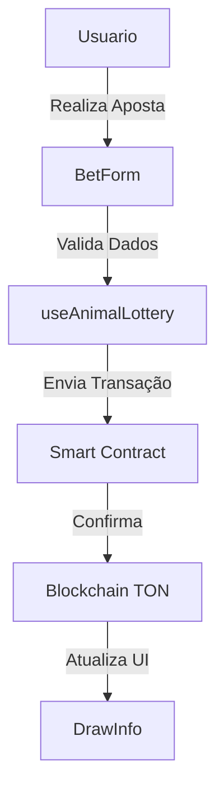

# TWA Open Lottery

[](https://github.com/govinda777/twa-open-lottery/blob/main/LICENSE)
[](https://github.com/govinda777/twa-open-lottery)
[](https://app.netlify.com/sites/twa-lottery/deploys)

Bem-vindo ao **TWA Open Lottery**, uma plataforma SaaS (Software como Serviço) desenvolvida para modernizar e tornar transparente o gerenciamento de apostas e loterias através do Telegram Web App (TWA).

🔗 [Repositório no GitHub](https://github.com/govinda777/twa-open-lottery)

## 📋 Índice

1. [Visão Geral](#-visão-geral)
2. [Pré-requisitos](#-pré-requisitos)
3. [Início Rápido](#-início-rápido)
4. [Configuração do Web App](#-configuração-do-web-app)
5. [Desenvolvimento](#-desenvolvimento)
6. [Principais Funcionalidades](#-principais-funcionalidades)
7. [Contribuindo](#-contribuindo)
8. [Licença](#-licença)

## 📖 Visão Geral

Este projeto oferece:
- **Suporte a carteiras Ton Connect 2**
- **Stack moderna com Vite + React**
- **Integração com blockchain TON**
- **Sistema completo de apostas e sorteios**
- **Interface TWA otimizada**

## 🔧 Pré-requisitos

- Node.js v16+
- Uma carteira compatível com Ton Connect (ex: [Tonkeeper](https://tonkeeper.com/))
- Conta no Telegram
- Git

## 🚀 Início Rápido

1. **Use este template**
   ```bash
   # Clique no botão "Use this template" no GitHub
   # IMPORTANTE: Marque "Include all branches"
   ```

2. **Clone e Configure**
   ```bash
   # Clone seu novo repositório
   git clone https://github.com/seu-usuario/seu-twa-lottery.git
   cd seu-twa-lottery

   # Instale as dependências
   npm install

   # Configure os hooks do Git
   npx husky install
   ```

## ⚙️ Configuração do Web App

1. **Crie um Bot no Telegram**
   ```bash
   # Abra @BotFather no Telegram
   /newbot
   # Siga as instruções para nomear seu bot
   # Guarde o token fornecido
   ```

2. **Crie o Web App**
   ```bash
   # No BotFather
   /newapp
   # Selecione seu bot
   # Digite o título: "TWA Lottery"
   # Forneça uma descrição
   # Envie uma imagem 640x360px
   ```

3. **Vincule o Bot ao App**
   ```bash
   # Execute o script de configuração
   npm run configbot
   # Insira o token do bot quando solicitado
   ```

## 💻 Desenvolvimento

1. **Inicie o Ambiente Local**
   ```bash
   npm run dev
   ```

2. **Implantação**
   ```bash
   # A implantação é automática ao fazer push para main
   git push origin main
   ```

## 🎯 Principais Funcionalidades

### Sistema de Apostas
- Interface intuitiva para apostas
- Integração com TON Connect 2
- Registro na blockchain

### Gestão de Pagamentos
- Smart contracts automatizados
- Distribuição segura de prêmios
- Histórico transparente

### Administração
- Dashboard para gestores
- Relatórios em tempo real
- Controle de regiões

## 🤝 Contribuindo

1. Faça um Fork
2. Crie sua Feature Branch
   ```bash
   git checkout -b feature/NovaFuncionalidade
   ```
3. Commit suas mudanças
   ```bash
   git commit -m 'Adiciona nova funcionalidade'
   ```
4. Push para a Branch
   ```bash
   git push origin feature/NovaFuncionalidade
   ```
5. Abra um Pull Request

# TWA Open Lottery

[... seções anteriores ...]

## 🏗 Arquitetura do Projeto

O TWA Open Lottery segue uma arquitetura modular e bem organizada, facilitando a manutenção e escalabilidade do sistema.

### Estrutura de Diretórios

```
src/
  ├── components/              # Componentes React
  │   ├── styled/             # Componentes estilizados
  │   │   ├── components.ts   # Componentes reutilizáveis
  │   │   └── theme.ts        # Configuração de tema
  │   ├── BetForm.tsx         # Formulário de apostas
  │   ├── DrawInfo.tsx        # Informações do sorteio
  │   ├── BetsList.tsx        # Lista de apostas
  │   └── BankerDashboard.tsx # Dashboard do bicheiro
  ├── contracts/              # Contratos inteligentes
  │   ├── AnimalLottery.ts    # Contrato principal
  │   └── interfaces.ts       # Interfaces dos contratos
  ├── hooks/                  # Hooks personalizados
  │   ├── useAnimalLottery.ts # Hook principal da loteria
  │   ├── useBanker.ts        # Hooks específicos do bicheiro
  │   └── useBets.ts          # Hooks relacionados a apostas
  ├── types/                  # Tipos TypeScript
  │   └── types.ts           
  ├── constants/              # Constantes da aplicação
  │   ├── animals.ts          # Definições dos animais
  │   └── config.ts           # Configurações gerais
  └── utils/                  # Utilitários
      ├── format.ts           # Formatação
      └── validation.ts       # Validação
```

### Componentes Principais

#### 1. Components
- **BetForm**: Gerencia o processo de apostas
  ```typescript
  interface BetFormProps {
    onSubmit: (bet: BetData) => Promise<void>;
    availableAnimals: Animal[];
  }
  ```

- **DrawInfo**: Exibe informações do sorteio atual
  ```typescript
  interface DrawInfoProps {
    currentDraw: Draw;
    nextDrawTime: Date;
  }
  ```

#### 2. Contratos
- **AnimalLottery.ts**: Implementa a lógica principal da loteria
  ```typescript
  class AnimalLottery {
    placeBet(animal: number, amount: string): Promise<Transaction>;
    claimPrize(drawId: number): Promise<Transaction>;
    // ...
  }
  ```

#### 3. Hooks Personalizados
- **useAnimalLottery**: Hook principal para interação com o contrato
  ```typescript
  const useAnimalLottery = () => {
    const placeBet = async (data: BetData) => { /* ... */ };
    const checkWinnings = async (drawId: number) => { /* ... */ };
    return { placeBet, checkWinnings /* ... */ };
  };
  ```

### Fluxo de Dados



### Sistema de Temas

O projeto utiliza um sistema de temas consistente:

```typescript
// theme.ts
export const theme = {
  colors: {
    primary: '#1DA1F2',
    secondary: '#14171A',
    success: '#17BF63',
    error: '#E0245E',
  },
  spacing: {
    small: '8px',
    medium: '16px',
    large: '24px',
  },
  // ...
};
```

### Integração TON

A integração com a blockchain TON é gerenciada através de camadas específicas:

```typescript
// Exemplo de integração com TON
import { TonClient } from '@ton/ton';

export class TonIntegration {
  private client: TonClient;

  constructor() {
    this.client = new TonClient({
      endpoint: 'https://toncenter.com/api/v2/jsonRPC',
    });
  }

  async deployContract(code: Cell, data: Cell): Promise<Address> {
    // Lógica de deploy
  }

  async sendTransaction(address: Address, message: Cell): Promise<Transaction> {
    // Lógica de transação
  }
}
```

### Segurança e Validação

O sistema implementa várias camadas de segurança:

1. **Validação de Entrada**
   ```typescript
   // validation.ts
   export const validateBet = (bet: BetData): ValidationResult => {
     // Regras de validação
   };
   ```

2. **Proteção de Transações**
   ```typescript
   // useAnimalLottery.ts
   const secureBet = async (bet: BetData) => {
     try {
       await validateBet(bet);
       // Processo de aposta segura
     } catch (error) {
       handleError(error);
     }
   };
   ```

### Testes

A estrutura de testes segue a organização do projeto:

```
tests/
  ├── components/
  │   └── BetForm.test.tsx
  ├── contracts/
  │   └── AnimalLottery.test.ts
  └── hooks/
      └── useAnimalLottery.test.ts
```

[... resto do documento ...]

## 📄 Licença

Este projeto está sob a Licença MIT. Veja o arquivo [LICENSE](LICENSE) para detalhes.

---

⭐️ Se este projeto te ajudou, considere dar uma estrela no GitHub!